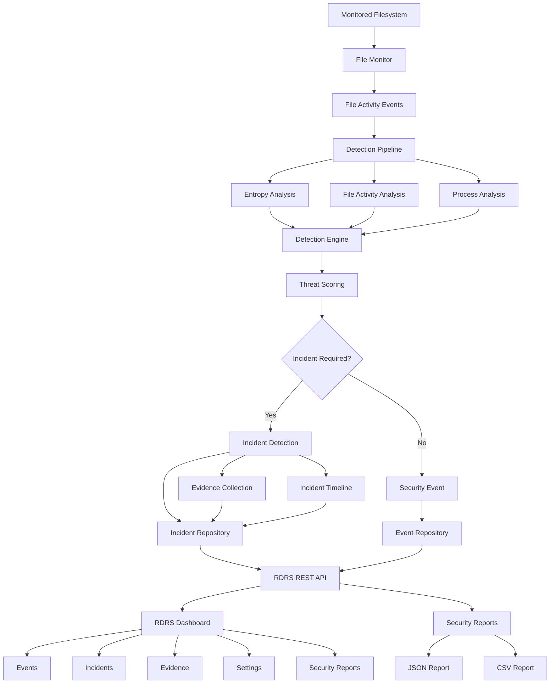

# RDRS Architecture

## System Architecture

RDRS is organized as a real-time security monitoring and incident detection pipeline.



## Detection Pipeline

The core detection pipeline processes filesystem activity through multiple analysis stages:

```text
Monitored Files
      |
      v
File Activity Monitor
      |
      v
Security Events
      |
      v
Detection Pipeline
      |
      +----> Entropy Analysis
      |
      +----> File Activity Analysis
      |
      +----> Process Analysis
      |
      v
Detection Engine
      |
      v
Threat Scoring
      |
      v
Incident Decision
      |
      +---- No ----> Security Event
      |
      +---- Yes ---> Incident
                       |
                       +----> Evidence
                       |
                       +----> Timeline
                       |
                       +----> Incident Repository
```

## Main Components

### File Monitoring

Monitors configured filesystem paths and generates events for relevant file activity.

### Detection Engine

Combines multiple detection indicators and evaluates suspicious behavior.

### Entropy Analysis

Analyzes file entropy to identify potentially suspicious high-entropy file activity.

### Threat Scoring

Combines detection indicators using configured scoring weights to determine the severity of suspicious activity.

### Incident Detection

Converts significant suspicious activity into security incidents and maintains incident state.

### Evidence Collection

Stores relevant evidence associated with detected incidents.

### Incident Timeline

Maintains a chronological record of incident-related activity.

### REST API

The FastAPI-based REST API provides access to events, incidents, evidence, reports, settings, and monitoring controls.

### Dashboard

The web dashboard provides a security monitoring interface for:

- Events
- Incidents
- Evidence
- Settings
- Security Reports

### Security Reports

RDRS provides incident reports in:

- JSON format
- CSV format

## Data Flow

```text
Filesystem Activity
        |
        v
Event Generation
        |
        v
Detection Pipeline
        |
        v
Threat Analysis
        |
        v
Threat Score
        |
        v
Incident Decision
        |
        +------------------+
        |                  |
        v                  v
     Event             Incident
                           |
                           v
                    Evidence + Timeline
                           |
                           v
                    Incident Repository
                           |
                           v
                       REST API
                           |
              +------------+------------+
              |                         |
              v                         v
          Dashboard              Security Reports
                                  /          \
                                 v            v
                              JSON           CSV
```

## Deployment

RDRS can run as a local security monitoring service using Uvicorn and a user-level systemd service.

```text
RDRS Application
      |
      v
Uvicorn
      |
      v
FastAPI Application
      |
      v
RDRS Security Monitoring Service
      |
      v
Configured Monitoring Paths
```

## Technology Stack

- Python
- FastAPI
- SQLAlchemy
- SQLite
- Pydantic
- Watchdog
- psutil
- PyYAML
- Uvicorn
- Jinja2
- ReportLab
- Pytest
